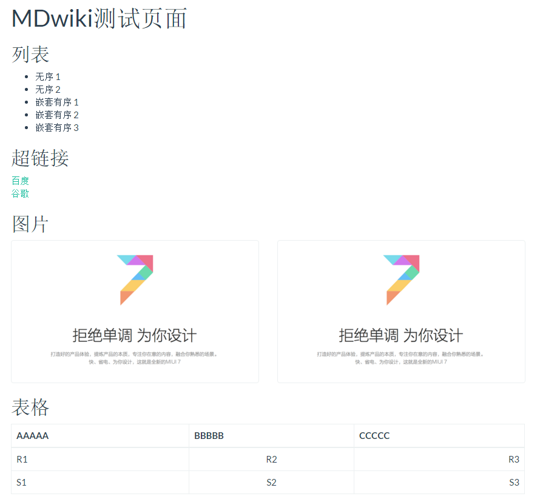
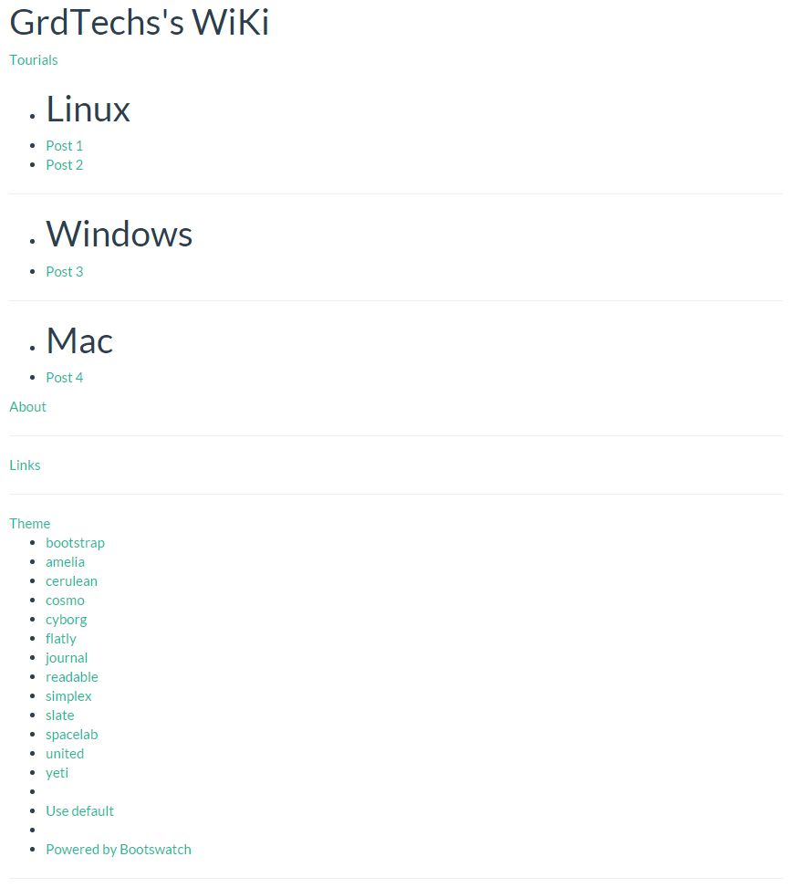
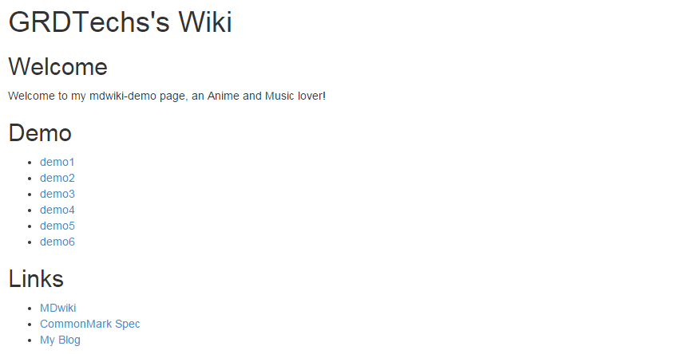

# MDwiki 使用手册

Note: MDwiki is a CMS/Wiki system using Javascript for 100% client side single page application using Markdown.

## 搭建本地MDwiki

[MDwiki](https://github.com/Dynalon/mdwiki)是一个完全使用 HTML5/Javascript 技术构建，完全运行在客户端的 Wiki/CMS 系统。`无需专门的服务器软件，只需将 mdwiki.html 上传到你存放 markdown 文件的目录`。

** 特性 **

- 使用 HTML5/Javascript 构建，无需在本地或远程安装任何软件。

- 使用 Markdown 。

- 基于 jQuery 和 Bootstrap 3 的响应式布局。

- 增强的 Markdown 语法，例如代码高亮、GitHub Gists、Google 地图。

- 可以修改主题。支持所有 bootswatch 的主题。

** 工作过程 **

在开始 Markdown 之前先来介绍一下 mdwiki.html 的原理。
首先我们将 mdwiki.html 文件和你的 md 文件放在同一目录下
然后解析的时候就通过 `#!`，例如 `http://localhost:8080/mdwiki.html#!example.md`
由于大多数的 Web 服务器都会自动识别诸如 index.html、index.php 文件，所以如果将 `mdwiki.html` 重命名为 `index.html`，在多数 Web 服务器下都可以省略 `index.html` 而直接使用 `http://localhost:8080/#!example.md`。这也正是一开始就推荐用 index.html 的原因，但是原理肯定还是要说明一下滴。

** 安装环境 **
本文以 Linux 系统为例，Windows 以及 Mac 的话过程也是差不多的。

** 准备本地服务器 **
首先得有一个网页空间，这里先以本地硬盘作为网页空间。要访问本地文件，首先得有个 Web 服务器，由于 Apache、Nginx 之类的 Web 服务器配置较多而且暂时不需要用到，所以就以 npm 的 http-server 作为本文的 Web 服务器。

** 首先安装 nvm 这个 Node.js 版本控制工具 **
```bash
curl -o- https://raw.githubusercontent.com/creationix/nvm/v0.29.0/install.sh | bash
```

** 安装 Node.js (需要哪些版本可以使用 nvm ls-remote 查看所有版本) **
```bash
nvm install v0.12.7
```

** 安装 http-server **
```bash
npm install http-server -g
```

** 搭建本地MDwiki **
**MDwiki 的原理事实上就是使用一个 HTML 文件来实时解析用户自己编写的 md 文件，从而免去了将 md 文件编译成 html 静态文件的过程。** 所以接下来就是下载这个 Markdown 文件了。
所以搭建本地MDwiki, 只需要把MDwiki提供的MDwiki.html 放到Markdown文件夹目录下即可。获取这个mdwiki.html 有两个方法，如下： 
**方法一**: 从已经编译好的github 上fork 一份出来（不能保证是最新的版本）

- 创建博客主目录 
```bash
mkdir my-mdwiki 
```
- 下载已编译好的mdwiki
```bash
wget https://github.com/Dynalon/mdwiki/releases/download/0.6.2/mdwiki-0.6.2.zip
```

- 解压
```bash
unzip  mdwiki-0.6.2.zip
```

- 复制 mdwiki.html 文件并改名为 index.html 放到博客主目录下
```bash
cp mdwiki-0.6.2/mdwiki.html my-mdwiki/index.html
```

**方法二**：下载[MDkiwi git源码](https://github.com/Dynalon/mdwiki)编译生成mdwiki.html (这个通常可以得到最新版本的mdwiki.html)

- 下载源码
```bash 
git clone https://github.com/Dynalon/mdwiki.git
```

- 编译 (make 即可)
```bash
cd mdwiki
make 
```
编译之后会生成一个dist文件夹，里面有两个文件分别为 mdwiki-debug.html 和 mdwiki.html,选择mdwiki.htl 复制到博客目录下即可。 
```bash
cp dist/mdwiki.html my-mdwiki/index.html
```
** 注意: ** 这样编译得到的`mdwiki.html` 里面引用的`js,jquery`等文件都是引用自`google`等需要翻墙的网站，所以如果你在墙内，则需要手动替换才能用了，如果你用的`vpn`则没什么关系。

- 启动 http 服务
```bash
cd my-mdwiki 
http-server
```
一般来说没什么问题的话都会提示 http-server 已启动,则通过`http://localhost:8080/#!index.md`来访问MDwiki了。


## 发布到github.io
上面只是搭建好了本地的MDwiki, 如此之简单；如果希望在公网上可以访问到，其中一种办法就是发布到github.io上托管。

- 初始化本地git repo
```bash
cp my-mdwiki
git init
```

- 切换分支为gh-pages ，否则发布之后无法访问解析(github 会把通过gh-pages分支发布上来的文件 解析为一个pages site, 从而可以通过浏览器访问)
```bash
git symbolic-ref HEAD refs/heads/gh-pages
```
- 提交内容
```bash
git add .
git commit -m "Initial Commit"
```
- 添加远程地址 就是在github 上已经建立好的git repo my-mdwiki
```bash
git remote add origin git@github.com:YOURUSERNAME/my-mdwiki.git
git push -u origin gh-pages
```
就可以直接通过`http://YOURUSERNAME.github.io/my-mdwiki` 访问了。

## Markdown 快速入门
由于 MDwiki 使用的是纯 Markdown 语言，所以你必须得先会点 Markdown 语言基础哈。

** 基本框架 **

一个简单的 Markdown 文件看起来应该像
```bash
标题
====

子标题
------

  * 无序列表项目 1
  - 无序列表项目 2
  1. 有序列表项目 1
  2. 有序列表项目 2

超级链接 [Google](http://google.com)

图片链接看起来跟超级链接类似，只是前面多了个感叹号：

主标题下方使用 = 标记
子标题下方使用 - 标记
无序列表使用 * 或者 - 标记
超级链接使用 [Description](URL)，其中 URL 可以是网络资源也可以是本地资源。
图片链接使用 ，其中 URL 可以是网络资源也可以是本地资源。
注意缩进和换行，这是个好习惯，某些时候却是必须严格遵守的！
MDwiki 使用了 GitHub flavored markdown dialect。所以如果有需要，你可以这样创建一个表格

| Tables        | Are           | Cool  |
| ------------- |:-------------:| -----:|
| col 3 is      | right-aligned | $1600 |
| col 2 is      | centered      |   $12 |
| zebra stripes | are neat      |    $1 |
----- 代表默认的左对齐，等同于 :-----
:-----: 代表居中对齐
-----: 代表右对齐
```
** 一起看个完整的实例 **
```bash
MDwiki测试页面
==============

列表
----

  * 无序 1
  - 无序 2
  1. 嵌套有序 1
  2. 嵌套有序 2
  3. 嵌套有序 3

超链接
------
[百度](http://www.baidu.com)
[谷歌](http://www.google.com)

图片
----


表格
----
| AAAAA | BBBBB | CCCCC |
| ----- |:-----:| -----:|
| R1    | R2    | R3    |
| S1    | S2    | S3    |
```
先在脑海里想象一下样子，然后打开预览看看！怎么样，跟你想象的是一样的吗？



现在我们的页面长什么样子？** No Navigation **

** 导航栏实现 **

在`my-mdwiki`目录下新建并编辑`navigation.md`文件
```bash
[Home](index.md)
[About](about.md)
```
现在我们就有了一个简单的导航栏了~ 需要其他的栏目也是按照一样的语法添加即可。


接下来再来点高级点的 —— 二级菜单
```bash
# GRDTechs's WiKi

[Tourials]()

* # Linux
* [Post 1](post1.md)
* [Post 2](post2.md)
- - - -
* # Windows
* [Post 3](post3.md)
- - - -
* # Mac
* [Post 4](post4.md)

[About](about.md)
- - - -
[Links](links.md)
- - - -
[gimmick:themechooser](Theme)
- - - - 
[gimmick:theme](cosmo)
```
可以看出 Tourials 是一个二级下拉菜单，它包括 Linux、Windows 和 Mac 三个子菜单，子菜单又分别列出了相应的文章目录。




子菜单名称前的`#`是必须的，`*` 代表了这个菜单是无序的，即无编号。
子菜单之间的分隔` - - - - `也是必须的。
主菜单之间的分隔` - - - - `不是必须的，但是建议加上。
`gimmick:themechooser` 是一个主题选择器。
`gimmick:theme` 则选择指定的主题。
这些都是可以在导航栏里实现的。


** 超链接使用 **

在上面我们稍微接触到了超链接，这里另外详细说明一下超链接的用法。

第一种，比如要设置一个超链接到 `https://google.com/`，只需要使用 `[Google](https://google.com)`。
第二种，比如要设置一个超链接到博客本身的某个文件，例如 `~/my-mdwiki/demo1.md。`还记得前面说过的吗，解析` md `文件需要用到 `#!`，但是如果是在超链接中则可以省略 `#!`，直接使用 `[Demo 1](demo1.md)`。

** 图片使用 **

图片的基本用法是 ``，其中 alt 用于当图片无法显示的时候替代图片位置上显示的文字提示。
title 用于当鼠标移动到图片上的时候显示的提示信息。


** 图片和超链接嵌套使用 **
有时候我们需要点击一张图片的时候不是显示图片而是跳转到某个链接去，这时候我们就可以嵌套使用超链接和图片了。

[](http://www.grdtechs.com/)

点我预览 就是这么简单！

** 代码高亮 **

这部分应该是各位博友们最经常用到的功能之一了，Markdown 的语法高亮也是非常的方便的！

代码高亮有两种形式：一种是`单行`，一种是`多行`。

`单行`比较简单，仅需要用使`反引号` (键盘上数字1左边，Tab 键上方，需要在英文输入模式下) 包围在需要高亮的代码前后即可。

`多行`也是很简单，只是弥补了单行的不足，比如支持多行、支持针对语言！

基本用法则是在代码前后使用`3个反引号`，比如前面贴出的各段代码。

若要支持特定语言的语法，则可加上该语言的名称，例如
```javascript
var hello = function () {
		    // say hello
		    alert('Hello world!');
	}
```
** 页面布局 **
前面我们已经大致了解了撰写一篇 Markdown 文章所需要的基本语法了，这一部分我将介绍一些关于布局的问题。

总体布局在我们前面的 demo1 已经介绍过了，主要就是像这样
```bash
主标题
======

分级标题 1
----------
内容

分级标题 2
----------
内容

分级标题 3
----------
```

** 内容 **
这里主要要介绍的是图文混排，图片与图片、图片与文本之间的位置关系。

** 图片居于文字左边 **

将图片的链接放置在段落文本的正上方，中间不加换行。


这里是段落内容，注意两行中间并没有任何的换行！

** 图片居于文字右边 **

将图片的链接放置在段落文本的正下方，中间不加换行。

这里是段落内容，注意两行中间并没有任何的换行！


** 图片与文字无关 **

只需要在文字与图片之间加上换行即可。


这里是段落内容，注意两行中间有换行！

** 图片并排 **

两张图片的链接并列，中间没有换行。


** 组合效果 **

借助上面的几种图文混排效果我们还可以实现组合效果，例如图片并排然后居于段落文字左边。


这里是段落内容，注意两行中间并没有任何的换行！

** 自定义配置 **
自定义配置主要是在一些小细节上作调整，由于官方目前开放的配置参数还太少，所以本文也就不做太细致的介绍了，只说一下笔者用到的几个。

** 主题选择器 **

这个东西在前面的导航栏介绍里有说到过了，引用官方的说法这是一个特殊的花招 (gimmick)，要启用它可以在 navigation.md 里加上。
```bash
[gimmick:themechooser](Theme)
```
而与主题选择器相对应的自然就是选择一个主题，注意的是这里指的是选择一个默认主题，MDwiki 默认的主题是 bootstrap，我们可以修改成其他的。

```bash
[gimmick:theme](flatly)
```
需要注意的是，只有默认的 bootstrap 主题支持离线，也就是说其他的主题都需要联网才能使用，所支持的主题可以看主题选择器里列出的。
要启用此参数一样也是在 navigation.md 里加上。

** 配置文件 **

这是一个官方开放的可由用户自定义的配置文件(虽然现在开放的参数少得可怜)，新建一个 config.json 文件与 mdwiki.html 文件放置在同一文件夹下。

一个简单的 config.json 文件应该像这样
```json
{
	    "useSideMenu": true,
	    "additionalFooterText": "© 2015 YumeMichi ",
	    "title": "YumeMichi's MDwiki Demo Page",
	    "anchorCharacter": "#"
}
```

`"useSideMenu": true` - 启用侧面的导航栏，也就是页面左边的导航栏。
`additionalFooterText: ""` - 可以用来在页面底部添加版权信息等其他文字信息，默认为空。
`"title": ""` - 添加选项卡栏处现实的网页标题，这个参数官方是没有开放的，感谢MR菊苣提供！
`"anchorCharacter": "#" `- 当鼠标移动到分级标题上显示的一个图标，笔者也不知道是干嘛的，默认是¶。

** 主页设计 **

到此，`MDwiki` 就只剩下主页了，主页就相对简单了，就是利用我们前面所学的设计出一个主页，命名为 `index.md`，以下是我的 demo 主页
```bash
GRDTechs's Wiki
================

Welcome
------
Welcome to my mdwiki-demo page, an Anime and Music lover!

Demo
-------
  - [demo1](demo1.md)
  - [demo2](demo2.md)
  - [demo3](demo3.md)
  - [demo4](demo4.md)
  - [demo5](demo5.md)
  - [demo6](demo6.md)

Links
-----
  - [MDwiki](http://dynalon.github.io/mdwiki/)
  - [CommonMark Spec](http://jgm.github.io/stmd/spec.html)
  - [My Blog](https://blog.ikke.moe)
```
显示结果



** 参 考 **
1. [MDwiki 搭建静态博客教程](https://blog.ikke.moe/posts/mdwiki-tourial/) 
2. [Setting up MDwiki with GitHub](http://blog.devalias.net/post/92579952637/mdwiki-and-how-to-get-started) 

