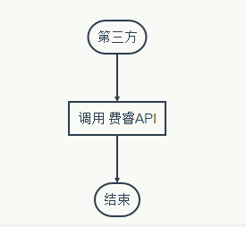

#费芮 weixin API 文档 V1.0

##1、文档说明
* 1.1 [流程说明](index.md#1.1_流程说明)
* 1.2 [费芮提供的服务](index.md#1.2_费芮提供的服务)
* 1.3 [调用流程图](index.md#1.3_调用流程图)
* 1.4 [字符编码](index.md#1.4_字符编码)
* 1.5 [在线接口测试工具](index.md#1.5_在线接口测试工具)
* 1.6 [返回值结构说明](index.md#1.6_返回值结构说明)

###1.1 流程说明
第三方将需处理的业务数据以"key=value"形式通过HTTP的GET/POST请求发送给费芮接口，费芮接口将负责与微信API的业务处理与维护工作，并将业务处理结果以JSON格式返回给第三方。第三方每次发送请求都将收到费芮接口的响应结果（响应返回格式为JSON格式），另外双方需要保证数据传输的完整性和安全性。

###1.2 费芮提供的服务
 1. 第三方可通过向费芮接口发起相应http请求，即可完成第三方自身与微信接口相应的业务处理。
 2. 维护微信的`AccessToken`, 每隔7000 秒更新一次微信`AccessToken`。
 3. 将第三方的请求数据封装并调用微信API接口进行相应的业务处理。
 4. 将业务处理结果定制化返回给第三方。

###1.3 调用流程图

<center>  </center>

> 如果接口返回的状态码`retcode`等于200,即表示调用成功，如果不是，将通过`msg`字段返回错误原因。 

###1.4 字符编码
接口服务器接收数据必须为 UTF-8 编码，如提交编码为 GBK，请自行转码。请求相应返回内容为 JSON 格式。

###1.5 在线接口测试工具
http://supervise.verystar.cn/api_test/hiproapi_test

###1.6 返回值结构说明
返回值为 JSON 格式。每次请求都会返回 3 个字段： 

| 字段名称 | 描述 |
| :-------- | :------ |
| retcode |  为  200  代表成功，其他值为失败。|
| msg |当 retcode  不为  200  时返回操作失败说明。| 
| data |  当请求有需要返回数据时，数据通过 data 字段传递。 |


##2、接口协议
* 2.1 [适用协议](index.md#2.1_适用协议)
* 2.2 [安全认证机制](index.md#2.2_安全认证机制)
* 2.3 [Authcode 机制](index.md#2.3_Authcode_机制)
* 2.4 [签名示例](index.md#2.4_签名示例)

###2.1 协议说明
* `HTTP` 协议适用于通过API进行支付信息相关的数据处理
* `JSON` 作为调用微信接口的标准数据协议

###2.2 安全认证机制
客户向我方申请接口调用权限，我方会向客户提供一个 `client_code `字符串和一个`client_secret` 字符串作为身份证明和请求许可性验证。`client_code `字符串需要跟随每次请求传递给费芮接口， `client_secret `字符串作为生成 `authcode `验证码的干扰噪点，注意`client_secret`禁止通过API接口传递。请求参数必须包含`req_time`字段，`req_time` 字段为请求时间的 UNIX 时间戳（十位）， 超时 5 分钟的请求将被服务器拒绝。 

###2.3 Authcode 机制
首先，将签名参数（即请求参数 和 `client_secret`） 按照字段名的ASCII码从小到大排序（字典序）后，将各个签名参数的 value字段拼接成字符串stringA（即value1value2…）。然后把拼接好的字符串stringA进行MD5加密,加密值作为 authcode参数传递给费芮接口。authcode通过 GET 方式传递，其余参数都通过 POST 方式传递。

>1. 如果某个签名参数的值为空，则不用于生成签名值
>2. 字段名和字段值都采用原始值，不进行URL 转义

###2.4 签名示例

####Authcode 生成步骤:

首先，将签名参数（即请求参数 和 `client_secret`） 按照字段名的ASCII码从小到大排序（字典序）后，将各个签名参数的 value字段拼接成字符串stringA（即value1value2…）；然后把拼接好的字符串stringA进行MD5加密,加密值作为 authcode参数传递给费芮接口。authcode通过 GET 方式传递，其余参数都通过 POST 方式传递。

>请注意以下重要规则:
 　　应按照字段名的ASCII码从小到大排序（字典序）;
 　　如果某个签名参数字段值为空，则剔除该签名字段;
 　　签名参数大小写敏感;

####示例:

以生成3.1 设置跳板信息接口的authcode为例:
则签名参数为：请求参数（client_code，req_time，oauth_type，redirect_uri）和 client_secret 。
假设现有如下签名参数:
redirect_uri:http://www.verystar.cn
oauth_type:oauth_snsapi_base

req_time:1459817487

client_code:ayAXXiXU6rXkBZAE464MVi8Wniwrrlp3GEX1M6
client_secret:AZa-zsn6lbaOxCpQzq85ijiaiOo6yBrcFqiaEv

步骤 1:
stringA = ayAXXiXU6rXkBZAE464MVi8Wniwrrlp3GEX1M6AZa-zsn6lbaOxCpQzq85ijiaiOo6yBrcFqiaEvoauth_snsapi_basehttp://www.verystar.cn1459817487
步骤 2:
authcode = md5(stringA)
步骤 3:
authcode value = ff855997852eaebd899ce54fc094baed

##3、API 调用示例
* 3.1  [设置跳板信息](index.md#3.1_设置跳板信息)
* 3.2  [获取跳板信息](index.md#3.2_获取跳板信息)
* 3.3  [设置用户信息](index.md#3.3_设置用户信息)
* 3.4  [获取用户信息](index.md#3.4_获取用户信息)
* 3.5  [设置微信卡券Code码跳板信息](index.md#3.5_设置微信卡券Code码跳板信息)
* 3.6  [设置微信卡券跳板信息](index.md#3.6_设置微信卡券跳板信息)
* 3.7  [获取微信卡券跳板信息](index.md#3.7_获取微信卡券跳板信息)
* 3.8  [设置跳板信息测试接口](index.md#3.8_设置跳板信息测试接口)
* 3.9  [异步发送消息](index.md#3.9_异步发送消息)
* 3.10 [核销卡券code码](index.md#3.10_核销卡券code码)
* 3.11 [设置卡券失效](index.md#3.11_设置卡券失效)
* 3.12 [卡券code解码接口](index.md#3.12_卡券code解码接口)
* 3.13 [激活会员卡](index.md#3.13_激活会员卡)
* 3.14 [更新会员信息](index.md#3.14_更新会员信息)
* 3.15 [获取用户已领取的卡券](index.md#3.15_获取用户已领取的卡券)
* 3.16 [查询卡券详情](index.md#3.16_查询卡券详情)
* 3.17 [生成短链接](index.md#3.17_生成短链接)
* 3.18 [更新短链接](index.md#3.18_更新短链接)
* 3.19 [生成二维码](index.md#3.19_生成二维码)
* 3.20 [生成卡包信息](index.md#3.20_生成卡包信息)
* 3.21 [下载微信媒体](index.md#3.21_下载微信媒体)
* 3.22 [微信语音AMR转MP3](index.md#3.22_微信语音AMR转MP3)
* 3.23 [查询又拍云查询MP3转码进度](index.md#3.23_查询又拍云查询MP3转码进度)
* 3.24 [客服接口-发消息](index.md#3.24_客服接口-发消息)

###3.1 设置跳板信息

####接口说明
设置跳板信息

| URL      | http://hiproapi.verystar.cn/weixinapi/set_drawboard_data |
| :------- | :---- |
| Request 方法 | POST |
| Return 格式 | json |

####请求 Url 参数

| 名称 | 是否必须 | 类型 | 描述 |
| :-------- | :--------:| :------ | :------ |
| authcode | 是 | string |  签名值, 详情见 (#2.3 签名示例) |

####请求参数(POST)

| 名称 | 是否必须 | 类型 | 描述 |
| :-------- | :--------:| :------ | :------ |
| redirect_uri | 是 | string | 重定向uri |
| oauth_type | 是 | string | 授权类型 |
| client_code | 是 | string | `client_code`作为公钥用于验证用户ID |
| req_time | 是 | int | 请求时的时间戳 |

 
####返回值
```json
{
    "retcode": 200,
    "data":{
			"key": "09a501b3ad76038890ac3144ed71a67b",
			"app_id": "wxbff842159c0bb884",
			"component_appid": "",
			"redirect": "https://open.weixin.qq.com/connect/oauth2/authorize?appid=wxbff842159c0bb884\u0026redirect_uri=http%3A%2F%2Fcrmminisite.verystar.cn%2Fwx_service%2Foauth_snsapi_base\u0026response_type=code\u0026scope=snsapi_base\u0026state=09a501b3ad76038890ac3144ed71a67b#wechat_redirect"
		},
    "msg": null
}
```

####返回值状态说明

| 名称 | 类型 | 值  | 描述 |
| :-------- | :------ | :------ | :------ |
| retcode | int | 200 | 请求成功 |
| data | json格式 |  | SetDashBoard的返回值 |
| msg | string |  | 错误描述 |

####SetDashBoard的返回值结构说明
| 名称 | 类型 | 值  | 描述 |
| :-------- | :------ | :------ | :------ |
| key | string |  | 通过这个key获取对应的跳板信息 |
| app_id | string | | app应用唯一标识 |
| component_appid | string | | 第三方授权的component_appid |
| redirect | string | |重定向url  |

###3.2 获取跳板信息

####接口说明
获取跳板信息

| URL      | http://hiproapi.verystar.cn/weixinapi/get_drawboard_data |
| :------- | :---- |
| Request 方法 | POST |
| Return 格式 | json |

####请求 Url 参数

| 名称 | 是否必须 | 类型 | 描述 |
| :-------- | :--------:| :------ | :------ |
| authcode | 是 | string |  签名值, 详情见 (#2.3 签名示例) |

####请求参数(POST)

| 名称 | 是否必须 | 类型 | 描述 |
| :-------- | :--------:| :------ | :------ |
| key | 是 | int | 获取相应跳板信息的key |
| client_code | 是 | string | `client_code`作为公钥用于验证用户ID |
| req_time | 是 | int | 请求时的时间戳 |
 
####返回值
```json
{
    "retcode": 200,
    "data":{
		"client_code": "aaaaaa",
		"client_secret": "bbbbbbbbb",
		"app_id": "wx8bb372760c2440c5",
		"component_appid": "cccccccccc",
		"app_sec": "2211a3a61654f990d46adea43730c506",
		"is_third": 1,
		"access_token": "",
		"authorizer_access_token": "Dx8Fiwc3ycmBSrocORcERR0FRpX6IJM0MkGaBdFBzEmkJR_YAplXGdhoY98PYtEm0P-xTkR_FiTm4zYLNxUAe2zv5N7qOcUA5_b3D6hG4KQNWSjsddfsdfdsf",
		"component_access_token": "sdfdsfwerqtDx8Fiwc3ycmBSBzEmkJR_YAplXGdhoY98PYtEm0P-xTkR_FiTm4zYLNxUAe2zv5N7qOcUA5_b3D6hG4KQNWSjABAWFBwe"
	},
    "msg": null
}
```

####返回值状态说明

| 名称 | 类型 | 值  | 描述 |
| :-------- | :------ | :------ | :------ |
| retcode | int | 200 | 请求成功 |
| data | json格式 |  | GetDashBoard的返回值 |
| msg | string |  | 错误描述 |

####GetDashBoard的返回值结构说明
| 名称 | 类型 | 值  | 描述 |
| :-------- | :------ | :------ | :------ |
| client_code | string |  | 用户code码 |
| client_secret | string |  | 用户code码对应的secret |
| app_id | string | | app应用唯一标识 |
| component_appid | string | |第三方授权的component_appid |
| app_sec | string | | app应用唯一标识对应的secret |
| is_third | string | | 是否为第三方 |
| access_token | string | | 全局唯一票据 |
| authorizer_access_token | string | | 第三方授权的authorizer_access_token |
| component_access_token | string | | 第三方授权的component_access_token |

###3.3 设置用户信息

####接口说明
设置用户信息

| URL      | http://hiproapi.verystar.cn/weixinapi/set_user_data |
| :------- | :---- |
| Request 方法 | POST |
| Return 格式 | json |

####请求 Url 参数

| 名称 | 是否必须 | 类型 | 描述 |
| :-------- | :--------:| :------ | :------ |
| authcode | 是 | string |  签名值, 详情见 (#2.3 签名示例) |

####请求参数(POST)

| 名称 | 是否必须 | 类型 | 描述 |
| :-------- | :--------:| :------ | :------ |
| key | 是 | string | 跳板信息对应的key |
| user_data | 是 | string | 待设置的用户信息 |
| client_code | 是 | string | `client_code`作为公钥用于验证用户ID |
| req_time | 是 | int | 请求时的时间戳 |
 
####返回值
```json
{
    "retcode": 200,
    "data": "wejrklsjdfkjasiruwe",
    "msg": ""
}
```

####返回值状态说明

| 名称 | 类型 | 值  | 描述 |
| :-------- | :------ | :------ | :------ |
| retcode | int | 200 | 请求成功 |
| data | string |  | 跳板信息对应的key |
| msg | string |  | 错误描述 |

###3.4 获取用户信息

####接口说明
设置用户信息

| URL      | http://hiproapi.verystar.cn/weixinapi/get_user_data |
| :------- | :---- |
| Request 方法 | POST |
| Return 格式 | json |

####请求 Url 参数

| 名称 | 是否必须 | 类型 | 描述 |
| :-------- | :--------:| :------ | :------ |
| authcode | 是 | string |  签名值, 详情见 (#2.3 签名示例) |

####请求参数(POST)

| 名称 | 是否必须 | 类型 | 描述 |
| :-------- | :--------:| :------ | :------ |
| key | 是 | string | 跳板信息对应的key |
| client_code | 是 | string | `client_code`作为公钥用于验证用户ID |
| req_time | 是 | int | 请求时的时间戳 |
 
####返回值
```json
{
    "retcode": 200,
    "data": {    
            "openid":" OPENID",  
            " nickname": NICKNAME,   
            "sex":"1",   
            "province":"PROVINCE"   
            "city":"CITY",   
            "country":"COUNTRY",    
            "headimgurl":"http://wx.qlogo.cn/mmopen/g3MonUZtNHkdmzicIlibx6iaFqAc56vxLSUfpb6n5WKSYVY0ChQKkiaJSgQ1dZuTOgvLLrhJbERQQ4eMsv84eavHiaiceqxibJxCfHe/46",  
            "privilege":[ "PRIVILEGE1" "PRIVILEGE2" ],    
            "unionid": "o6_bmasdasdsad6_2sgVt7hMZOPfL" 
},
    "msg": ""
}
```

####返回值状态说明

| 名称 | 类型 | 值  | 描述 |
| :-------- | :------ | :------ | :------ |
| retcode | int | 200 | 请求成功 |
| data | json格式 |  | 用户信息 |
| msg | string |  | 错误描述 |

####用户信息结构说明

| 名称 | 类型 | 值  | 描述 |
| :-------- | :------ | :------ | :------ |
| openid | string | | 用户的唯一标识 |
| nickname | string | |	用户昵称 |
| sex | string | | 用户的性别，值为1时是男性，值为2时是女性，值为0时是未知 |
| province | string | |	用户个人资料填写的省份 |
| city | string | |	普通用户个人资料填写的城市 |
| country | string | | 国家，如中国为CN |
| headimgurl | string | |	用户头像，最后一个数值代表正方形头像大小（有0、46、64、96、132数值可选，0代表640*640正方形头像），用户没有头像时该项为空。若用户更换头像，原有头像URL将失效。 |
| privilege | string | | 用户特权信息，json 数组，如微信沃卡用户为（chinaunicom） |
| unionid | string | | 只有在用户将公众号绑定到微信开放平台帐号后，才会出现该字段。|

###3.5 设置微信卡券Code码跳板信息

####接口说明
设置微信卡券Code码跳板信息

| URL      | http://hiproapi.verystar.cn/weixinapi/set_wxcard_code_drawboard_data |
| :------- | :---- |
| Request 方法 | POST |
| Return 格式 | json |

####请求 Url 参数

| 名称 | 是否必须 | 类型 | 描述 |
| :-------- | :--------:| :------ | :------ |
| authcode | 是 | string |  签名值, 详情见 (#2.3 签名示例) |

####请求参数(POST)

| 名称 | 是否必须 | 类型 | 描述 |
| :-------- | :--------:| :------ | :------ |
| card_id | 是 | string | 卡券ID |
| redirect_uri | 是 | string | 回调uri |
| redirect_uri_name | 是 | string | 回调uri名称 |
| main_color | 是 | string | 卡券主要颜色 |
| show_btn | 是 | string | 是否显示按钮  |
| client_code | 是 | string | `client_code`作为公钥用于验证用户ID |
| req_time | 是 | int | 请求时的时间戳 |
| outer_id | 否 | int | 场景ID |
| success_uri | 否 | int | 设置成功回调的uri |

####返回值
```json
{
    "retcode": 200,
    "data": {
			"key": "afawerweesdfjoweurwe",
			"redirect": "http://crmminisite.verystar.cn/wx_service/card_wxcode?wx_card_key=" + "afawerweesdfjoweurwe"
		},
    "msg": ""
}
```

####返回值状态说明

| 名称 | 类型 | 值  | 描述 |
| :-------- | :------ | :------ | :------ |
| retcode | int | 200 | 请求成功 |
| data |  json格式 |  | 设置微信卡券Code码跳板返回值 |
| msg | string |  | 错误描述 |

####设置微信卡券Code码跳板返回值结构说明
| 名称 | 类型 | 值  | 描述 |
| :-------- | :------ | :------ | :------ |
| key | string |  |  微信卡券code码跳板信息key |
| redirect | string |  | 重定向url |

###3.6 设置微信卡券跳板信息

####接口说明
设置微信卡券跳板信息

| URL      | http://hiproapi.verystar.cn/weixinapi/set_wxcard_drawboard_data |
| :------- | :---- |
| Request 方法 | POST |
| Return 格式 | json |

####请求 Url 参数

| 名称 | 是否必须 | 类型 | 描述 |
| :-------- | :--------:| :------ | :------ |
| authcode | 是 | string |  签名值, 详情见 (#2.3 签名示例) |

####请求参数(POST)

| 名称 | 是否必须 | 类型 | 描述 |
| :-------- | :--------:| :------ | :------ |
| code | 是 | string | 卡券ID |
| redirect_uri | 是 | string | 回调uri |
| redirect_uri_name | 是 | string | 回调uri名称 |
| main_color | 是 | string | 卡券主要颜色 |
| client_code | 是 | string | `client_code`作为公钥用于验证用户ID |
| req_time | 是 | int | 请求时的时间戳 |
| show_btn | 否 | string | 是否显示按钮  |
| outer_id | 否 | int | 场景ID |
| success_uri | 否 | int | 设置成功回调的uri |

####返回值
```json
{
    "retcode": 200,
    "data": {
			"key": "sjdkfqwiouerjdsf",
			"redirect": "http://crmminisite.verystar.cn/wx_service/card?wx_card_key=" + "sjdkfqwiouerjdsf"
		},
    "msg": ""
}
```

####返回值状态说明

| 名称 | 类型 | 值  | 描述 |
| :-------- | :------ | :------ | :------ |
| retcode | int | 200 | 请求成功 |
| data |  json格式 |  | 设置微信卡券跳板返回值 |
| msg | string |  | 错误描述 |

####设置微信卡券Code码跳板返回值结构说明
| 名称 | 类型 | 值  | 描述 |
| :-------- | :------ | :------ | :------ |
| key | string |  |  微信卡券跳板信息key |
| redirect | string |  | 重定向url |

###3.7 获取微信卡券跳板信息

####接口说明
获取微信卡券跳板信息

| URL      | http://hiproapi.verystar.cn/weixinapi/get_wxcard_drawboard_data |
| :------- | :---- |
| Request 方法 | POST |
| Return 格式 | json |

####请求 Url 参数

| 名称 | 是否必须 | 类型 | 描述 |
| :-------- | :--------:| :------ | :------ |
| authcode | 是 | string |  签名值, 详情见 (#2.3 签名示例) |

####请求参数(POST)

| 名称 | 是否必须 | 类型 | 描述 |
| :-------- | :--------:| :------ | :------ |
| key | 是 | string | 跳板信息key |
| client_code | 是 | string | `client_code`作为公钥用于验证用户ID |
| req_time | 是 | int | 请求时的时间戳 |


####返回值
```json
{
    "retcode": 200,
    "data": {
		"code": "2331005",
		"redirect_uri": "www.verystar.cn",
		"redirect_uri_name": "费芮互动",
		"main_color": "red",
		"show_btn": "false",
		"client_code": "aaaaaa",
		"client_secret": "bbbbbbbbb",
		"app_id": "wx8bb372760c2440c5",
		"component_appid": "cccccccccc",
		"app_sec": "2211a3a61654f990d46adea43730c506",
		"is_third": 1,
		"access_token": "",
		"authorizer_access_token": "Dx8Fiwc3ycmBSrocORcERR0FRpX6IJM0MkGaBdFBzEmkJR_YAplXGdhoY98PYtEm0P-xTkR_FiTm4zYLNxUAe2zv5N7qOcUA5_b3D6hG4KQNWSjsddfsdfdsf",
		"component_access_token": "sdfdsfwerqtDx8Fiwc3ycmBSBzEmkJR_YAplXGdhoY98PYtEm0P-xTkR_FiTm4zYLNxUAe2zv5N7qOcUA5_b3D6hG4KQNWSjABAWFBwe",
		"api_ticket": "sdkfjsdlfjs",
		"outer_id": "1",
		"success_uri": "www.verystar.cn",
	},
    "msg": ""
}
```

####返回值状态说明

| 名称 | 类型 | 值  | 描述 |
| :-------- | :------ | :------ | :------ |
| retcode | int | 200 | 请求成功 |
| data |  json格式 |  | 微信卡券跳板信息 |
| msg | string |  | 错误描述 |

####微信卡券跳板信息结构说明
| 名称 | 类型 | 值  | 描述 |
| :-------- | :------ | :------ | :------ |
| code | string |  |  微信卡券跳板信息key |
| redirect_uri | string |  | 重定向uri |
| redirect_uri_name | string |  | 重定向uri名字 |
| main_color | string |  | 卡券背景色 |
| show_btn | string |  | 是否显示为按钮 |
| client_code | string |  | 用户code |
| client_secret | string |  | 用户secret |
| app_id | string |  | app应用ID |
| component_appid | string |  | 第三方授权的component_appid |
| app_sec | string |  | app应用secret |
| is_third | string |  | 是否为第三方 |
| access_token | string |  | 全局唯一凭证 |
| authorizer_access_token | string |  | 第三方授权的authorizer_access_token |
| component_access_token | string |  | 第三方授权的component_access_token |
| api_ticket | string |  | api临时凭证 |
| outer_id | string |  | 场景ID |
| success_uri | string |  | 调用后的重定向uri |

###3.8 设置跳板信息测试接口

####接口说明
设置跳板信息测试接口

| URL      | http://hiproapi.verystar.cn/weixinapi/set_drawboard_data_test |
| :------- | :---- |
| Request 方法 | POST |
| Return 格式 | json |

####请求 Url 参数

| 名称 | 是否必须 | 类型 | 描述 |
| :-------- | :--------:| :------ | :------ |
| authcode | 是 | string |  签名值, 详情见 (#2.3 签名示例) |

####请求参数(POST)

| 名称 | 是否必须 | 类型 | 描述 |
| :-------- | :--------:| :------ | :------ |
| redirect_uri | 是 | int | 重定向uri |
| oauth_type | 是 | int | 授权类型 |
| client_code | 是 | string | `client_code`作为公钥用于验证用户ID |
| req_time | 是 | int | 请求时的时间戳 |
 
####返回值
```json
{
    "retcode": 200,
    "data":{
		"key": "wjekjrkjdfsdfa",
		"app_id": "wx8bb372760c2440c5",
		"component_appid": "cccccccccc",
		"redirect": "www.verystar.cn",
	},
    "msg": ""
}
```

####返回值状态说明

| 名称 | 类型 | 值  | 描述 |
| :-------- | :------ | :------ | :------ |
| retcode | int | 200 | 请求成功 |
| data | json格式  |  | SetDashBoard的返回值 |
| msg | string |  | 错误描述 |

####SetDashBoard的返回值结构说明
| 名称 | 类型 | 值  | 描述 |
| :-------- | :------ | :------ | :------ |
| key | string |  | 通过这个key获取对应的跳板信息 |
| app_id | string | | app应用唯一标识 |
| component_appid | string | |第三方授权的component_appid |
| redirect | string | |重定向url  |

###3.9 异步发送消息接口

####接口说明
异步发送微信消息

| URL      | http://hiproapi.verystar.cn/weixinapi/async_send_tpl |
| :------- | :---- |
| Request 方法 | POST |
| Return 格式 | json |

####请求 Url 参数

| 名称 | 是否必须 | 类型 | 描述 |
| :-------- | :--------:| :------ | :------ |
| authcode | 是 | string |  签名值, 详情见 (#2.3 签名示例) |

####请求参数(POST)

| 名称 | 是否必须 | 类型 | 描述 |
| :-------- | :--------:| :------ | :------ |
| client_code | 是 | string | `client_code`作为公钥用于验证用户ID |
| req_time | 是 | int | 请求时的时间戳 |
| tpl_data | 是 | string | 将第三方请求数据封装成适用于微信API接口调用的Json格式 |
| callback_url | 否 | string | 回调Url |


####返回值
```json
{
    "retcode": 200,
    "data": 10,
    "msg": null
}
```

####返回值状态说明

| 名称 | 类型 | 值  | 描述 |
| :-------- | :------ | :------ | :------ |
| retcode | int | 200 | 请求成功 |
| data | int |  | 唯一发送ID |
| msg | string |  | 错误描述 |

###3.10 核销卡券code码

####接口说明
核销卡券code码

| URL      | http://hiproapi.verystar.cn/weixinapi/consume_card_code |
| :------- | :---- |
| Request 方法 | POST |
| Return 格式 | json |

####请求 Url 参数

| 名称 | 是否必须 | 类型 | 描述 |
| :-------- | :--------:| :------ | :------ |
| authcode | 是 | string |  签名值, 详情见 (#2.3 签名示例) |

####请求参数(POST)

| 名称 | 是否必须 | 类型 | 描述 |
| :-------- | :--------:| :------ | :------ |
| code | 是 | int | 需核销的Code码 |
| card_id | 是 | int | 卡券ID |
| client_code | 是 | string | `client_code`作为公钥用于验证用户ID |
| req_time | 是 | int | 请求时的时间戳 |
 
####返回值
```json
{
    "retcode": 200,
    "data": {
            "errcode":0,
            "errmsg":"ok",
            "card":{"card_id":"pFS7Fjg8kV1IdDz01r4SQwMkuCKc"},
            "openid":"oFS7Fjl0WsZ9AMZqrI80nbIq8xrA"
        },
    "msg": ""
}
```

####返回值状态说明

| 名称 | 类型 | 值  | 描述 |
| :-------- | :------ | :------ | :------ |
| retcode | int | 200 | 请求成功 |
| data | json格式 |  | 核销卡券code码返回值 |
| msg | string |  | 错误描述 |

####核销卡券code码返回值结构说明
| 名称 | 类型 | 值  | 描述 |
| :-------- | :------ | :------ | :------ |
| errcode | int |  | 错误码 |
| errmsg | string | | 错误信息 |
| openid | string | | 用户在该公众号内的唯一身份标识 |
| card_id | string | | 卡券ID  |

###3.11 设置卡券失效

####接口说明
设置卡券失效

| URL      | http://hiproapi.verystar.cn/weixinapi/abrogate_card_code |
| :------- | :---- |
| Request 方法 | POST |
| Return 格式 | json |

####请求 Url 参数

| 名称 | 是否必须 | 类型 | 描述 |
| :-------- | :--------:| :------ | :------ |
| authcode | 是 | string |  签名值, 详情见 (#2.3 签名示例) |

####请求参数(POST)

| 名称 | 是否必须 | 类型 | 描述 |
| :-------- | :--------:| :------ | :------ |
| code | 是 | int | 需设置失效的卡券Code码 |
| card_id | 是 | int | 卡券ID |
| client_code | 是 | string | `client_code`作为公钥用于验证用户ID |
| req_time | 是 | int | 请求时的时间戳 |
 
####返回值
```json
{
    "retcode": 200,
    "data":  {
            "errcode":0,
            "errmsg":"ok",
    },
    "msg": ""
}
```

####返回值状态说明

| 名称 | 类型 | 值  | 描述 |
| :-------- | :------ | :------ | :------ |
| retcode | int | 200 | 请求成功 |
| data | json格式 |  | 设置卡券code码失效返回值 |
| msg | string |  | 错误描述 |

####设置卡券code码失效返回值结构说明
| 名称 | 类型 | 值  | 描述 |
| :-------- | :------ | :------ | :------ |
| errcode | int |  | 错误码 |
| errmsg | string | | 错误信息 |

###3.12 卡券code解码接口

####接口说明
卡券code解码

| URL      | http://hiproapi.verystar.cn/weixinapi/decrypt_card_code |
| :------- | :---- |
| Request 方法 | POST |
| Return 格式 | json |

####请求 Url 参数

| 名称 | 是否必须 | 类型 | 描述 |
| :-------- | :--------:| :------ | :------ |
| authcode | 是 | string |  签名值, 详情见 (#2.3 签名示例) |

####请求参数(POST)

| 名称 | 是否必须 | 类型 | 描述 |
| :-------- | :--------:| :------ | :------ |
| encrypt_code | 是 | string(128) | 经过加密的Code码 |
| client_code | 是 | string | `client_code`作为公钥用于验证用户ID |
| req_time | 是 | int | 请求时的时间戳 |
 
####返回值
```json
{
    "retcode": 200,
    "data": {
            "errcode":0,
            "errmsg":"ok",
            "code":"751234212312"
     },
    "msg": ""
}
```

####返回值状态说明

| 名称 | 类型 | 值  | 描述 |
| :-------- | :------ | :------ | :------ |
| retcode | int | 200 | 请求成功 |
| data | json格式 |  | 卡券code码解码返回值 |
| msg | string |  | 错误描述 |

####卡券code码解码返回值结构说明
| 名称 | 类型 | 值  | 描述 |
| :-------- | :------ | :------ | :------ |
| errcode | int |  | 错误码 |
| errmsg | string | | 错误信息 |
| code | string | | 解密后获取的真实Code码 |

###3.13 激活会员卡

####接口说明
激活会员卡

| URL      | http://hiproapi.verystar.cn/weixinapi/membercard_active |
| :------- | :---- |
| Request 方法 | POST |
| Return 格式 | json |

####请求 Url 参数

| 名称 | 是否必须 | 类型 | 描述 |
| :-------- | :--------:| :------ | :------ |
| authcode | 是 | string |  签名值, 详情见 (#2.3 签名示例) |

####请求参数(POST)

| 名称 | 是否必须 | 类型 | 描述 |
| :-------- | :--------:| :------ | :------ |
| membership_number | 是 | string(20) | 会员卡编号，由开发者填入，作为序列号显示在用户的卡包里。可与Code码保持等值 |
| code | 是 | string(20) | 创建会员卡时获取的初始code |
| card_id | 是 | string | 会员卡ID |
| client_code | 是 | string | `client_code`作为公钥用于验证用户ID |
| req_time | 是 | int | 请求时的时间戳 |
| init_bonus | 否 | string（3072） | 初始积分，不填为0; 持白金会员卡到店消费，可享8折优惠 |
| init_balance | 是 | string（3072） | 初始余额，不填为0; 持白金会员卡到店消费，可享8折优惠 |
| init_custom_field_value1 | 否 | string（12） | 创建时字段custom_field1定义类型的初始值，限制为4个汉字，12字节 |
| init_custom_field_value2 | 否 | string（12） | 创建时字段custom_field2定义类型的初始值，限制为4个汉字，12字节 |
| init_custom_field_value3 | 否 | string（12） | 创建时字段custom_field3定义类型的初始值，限制为4个汉字，12字节 |
| activate_begin_time | 否 | unsigned int | 激活后的有效起始时间。若不填写默认以创建时的 data_info 为准。Unix时间戳格式 |
| activate_end_time | 否 | unsigned int | 激活后的有效截至时间。若不填写默认以创建时的 data_info 为准。Unix时间戳格式 |
 
####返回值
```json
{
    "retcode": 200,
    "data": {
        "errcode":0,
        "errmsg":"ok"
    },
    "msg": ""
}
```

####返回值状态说明

| 名称 | 类型 | 值  | 描述 |
| :-------- | :------ | :------ | :------ |
| retcode | int | 200 | 请求成功 |
| data | json格式 |  | 激活会员卡返回值 |
| msg | string |  | 错误描述 |

####激活会员卡返回值结构说明
| 名称 | 类型 | 值  | 描述 |
| :-------- | :------ | :------ | :------ |
| errcode | int | 0 | 错误码，0表示激活成功|
| errmsg | string | | 错误信息 |

###3.14 更新会员信息

####接口说明
更新会员信息

| URL      | http://hiproapi.verystar.cn/weixinapi/membercard_update |
| :------- | :---- |
| Request 方法 | POST |
| Return 格式 | json |

####请求 Url 参数

| 名称 | 是否必须 | 类型 | 描述 |
| :-------- | :--------:| :------ | :------ |
| authcode | 是 | string |  签名值, 详情见 (#2.3 签名示例) |

####请求参数(POST)

| 名称 | 是否必须 | 类型 | 描述 |
| :-------- | :--------:| :------ | :------ |
| code | 是 | string(20) | 卡券Code码 |
| card_id | 是 | string(12) | 卡券ID |
| client_code | 是 | string | `client_code`作为公钥用于验证用户ID |
| req_time | 是 | int | 请求时的时间戳 |
| add_bonus | 否 | int | 需要变更的积分，扣除积分用“-“表示 |
| add_balance | 否 | int | 需要变更的余额，扣除金额用“-”表示。单位为分 |
| bonus | 否 | int | 需要设置的积分全量值，传入的数值会直接显示，如果同时传入add_bonus和bonus,则前者无效 |
| balance | 否 | int | 需要设置的余额全量值，传入的数值会直接显示，如果同时传入add_balance和balance,则前者无效 |
| record_bonus | 否 | string(42) | 商家自定义积分消耗记录，不超过14个汉字 |
| record_balance | 否 | string(42) | 商家自定义金额消耗记录，不超过14个汉字 |
| custom_field_value1 | 否 | string（12） | 创建时字段custom_field1定义类型的最新数值，限制为4个汉字，12字节 |
| custom_field_value2 | 否 | string（12） | 创建时字段custom_field2定义类型的最新数值，限制为4个汉字，12字节 |
| custom_field_value3 | 否 | string（12） | 创建时字段custom_field3定义类型的最新数值，限制为4个汉字，12字节 |

####返回值
```json
{
    "retcode": 200,
    "data": {
            "errcode":0,
            "errmsg":"ok",
            "result_bonus": 100,
            "result_balance": 200,
            "openid":"oFS7Fjl0WsZ9AMZqrI80nbIq8xrA"
    },
    "msg": ""
}
```

####返回值状态说明

| 名称 | 类型 | 值  | 描述 |
| :-------- | :------ | :------ | :------ |
| retcode | int | 200 | 请求成功 |
| data | json格式 |  | 更新会员信息返回值 |
| msg | string |  | 错误描述 |

####更新会员信息结构说明
| 名称 | 类型 | 值  | 描述 |
| :-------- | :------ | :------ | :------ |
| errcode | int |  | 错误码,0为正常 |
| errmsg | string | | 错误信息 |
| result_bonus | int | | 当前用户积分总额 |
| result_balance | int | | 当前用户预存总金额 |
| openid | string | | 用户openid |

###3.15 获取用户已领取的卡券

####接口说明
获取用户已领取的卡券

| URL      | http://hiproapi.verystar.cn/weixinapi/get_card_list |
| :------- | :---- |
| Request 方法 | POST |
| Return 格式 | json |

####请求 Url 参数

| 名称 | 是否必须 | 类型 | 描述 |
| :-------- | :--------:| :------ | :------ |
| authcode | 是 | string |  签名值, 详情见 (#2.3 签名示例) |

####请求参数(POST)

| 名称 | 是否必须 | 类型 | 描述 |
| :-------- | :--------:| :------ | :------ |
| open_id | 是 | string  | 需要查询的用户openid |
| card_id | 是 | string  | 卡券ID。不填写时默认查询当前appid下的卡券 |
| client_code | 是 | string | `client_code`作为公钥用于验证用户ID |
| req_time | 是 | int | 请求时的时间戳 |
 
####返回值
```json
{
    "retcode": 200,
    "data": {
            "errcode":0,
            "errmsg":"ok",
            "card_list": [
                {"code": "xxx1434079154", "card_id": "xxxxxxxxxx"},
                {"code": "xxx1434079155", "card_id": "xxxxxxxxxx"}
            ]
    },
    "msg": ""
}
```

####返回值状态说明

| 名称 | 类型 | 值  | 描述 |
| :-------- | :------ | :------ | :------ |
| retcode | int | 200 | 请求成功 |
| data | json格式 |  | 获取用户已领取的卡券返回值 |
| msg | string |  | 错误描述 |

####获取用户已领取的卡券结构说明
| 名称 | 类型 | 值  | 描述 |
| :-------- | :------ | :------ | :------ |
| errcode | int |  | 错误码 |
| errmsg | string | | 错误信息 |
| card_list | Json | | 卡券列表 |

###3.16 查询卡券详情

####接口说明
查询卡券详情

| URL      | http://hiproapi.verystar.cn/weixinapi/get_card_info |
| :------- | :---- |
| Request 方法 | POST |
| Return 格式 | json |

####请求 Url 参数

| 名称 | 是否必须 | 类型 | 描述 |
| :-------- | :--------:| :------ | :------ |
| authcode | 是 | string |  签名值, 详情见 (#2.3 签名示例) |

####请求参数(POST)

| 名称 | 是否必须 | 类型 | 描述 |
| :-------- | :--------:| :------ | :------ |
| card_id | 是 | string | 需要查询的卡券ID |
| client_code | 是 | string | `client_code`作为公钥用于验证用户ID |
| req_time | 是 | int | 请求时的时间戳 |
 
####返回值
```json
{
    "retcode": 200,
    "data": {
            "errcode": 0,
            "errmsg": "ok",
            "card": //请参考微信官方文档
    },
    "msg": ""
}
```

####返回值状态说明

| 名称 | 类型 | 值  | 描述 |
| :-------- | :------ | :------ | :------ |
| retcode | int | 200 | 请求成功 |
| data | json格式 |  | 查询卡券详情返回值 |
| msg | string |  | 错误描述 |

####查询卡券详情返回值结构说明
| 名称 | 类型 | 值  | 描述 |
| :-------- | :------ | :------ | :------ |
| errcode | int |  | 错误码 |
| errmsg | string | | 错误信息 |
| card | | | 卡券详情结构,（请参考微信官方文档） |

###3.17 生成短链接

####接口说明
生成短链接

| URL      | http://hiproapi.verystar.cn/weixinapi/generate_tiny_url |
| :------- | :---- |
| Request 方法 | POST |
| Return 格式 | json |

####请求 Url 参数

| 名称 | 是否必须 | 类型 | 描述 |
| :-------- | :--------:| :------ | :------ |
| authcode | 是 | string |  签名值, 详情见 (#2.3 签名示例) |

####请求参数(POST)

| 名称 | 是否必须 | 类型 | 描述 |
| :-------- | :--------:| :------ | :------ |
| out_id | 是 | string | 场景ID |
| url | 是 | string | 需要被生成短链接的Url |
| client_code | 是 | string | `client_code`作为公钥用于验证用户ID |
| req_time | 是 | int | 请求时的时间戳 |
 
####返回值
```json
{
    "retcode": 200,
    "data": "http://ou.verystar.cn/tu/c65436a9088601a96203e1e96248fd03",
    "msg": ""
}
```

####返回值状态说明

| 名称 | 类型 | 值  | 描述 |
| :-------- | :------ | :------ | :------ |
| retcode | int | 200 | 请求成功 |
| data | string  |  | 生成的短链接url |
| msg | string |  | 错误描述 |

###3.18 更新短链接

####接口说明
更新短链接

| URL      | http://hiproapi.verystar.cn/weixinapi/update_tiny_url |
| :------- | :---- |
| Request 方法 | POST |
| Return 格式 | json |

####请求 Url 参数

| 名称 | 是否必须 | 类型 | 描述 |
| :-------- | :--------:| :------ | :------ |
| authcode | 是 | string |  签名值, 详情见 (#2.3 签名示例) |

####请求参数(POST)

| 名称 | 是否必须 | 类型 | 描述 |
| :-------- | :--------:| :------ | :------ |
| url_val | 是 | string | 待更新的短链接url的参数值 |
| url | 是 | string | 用于生成新的短链接的url  |
| client_code | 是 | string | `client_code`作为公钥用于验证用户ID |
| req_time | 是 | int | 请求时的时间戳 |
 
####返回值
```json
{
    "retcode": 200,
    "data":"http://ou.verystar.cn/tu/c65436a9088601a96203e1e962erwjsdkdj3",
    "msg": ""
}
```

####返回值状态说明

| 名称 | 类型 | 值  | 描述 |
| :-------- | :------ | :------ | :------ |
| retcode | int | 200 | 请求成功 |
| data | string |  | 更新之后的短链接url |
| msg | string |  | 错误描述 |

###3.19 生成二维码

####接口说明
生成二维码

| URL      | http://hiproapi.verystar.cn/weixinapi/generate_qrcode |
| :------- | :---- |
| Request 方法 | POST |
| Return 格式 | json |

####请求 Url 参数

| 名称 | 是否必须 | 类型 | 描述 |
| :-------- | :--------:| :------ | :------ |
| authcode | 是 | string |  签名值, 详情见 (#2.3 签名示例) |

####请求参数(POST)

| 名称 | 是否必须 | 类型 | 描述 |
| :-------- | :--------:| :------ | :------ |
| scene_id | 是 | string  | 领取场景值，用于领取渠道的数据统计，默认值为0 |
| qrcode_type | 是 | string  | 二维码类型 |
| expire_seconds | 是 | string  | 指定二维码的有效时间 |
| client_code | 是 | string | `client_code`作为公钥用于验证用户ID |
| req_time | 是 | int | 请求时的时间戳 |

####返回值
```json
{
    "retcode": 200,
    "data": {
            "errcode": 0,
            "errmsg": "ok",
            "ticket":      "gQHB8DoAAAAAAAAAASxodHRwOi8vd2VpeGluLnFxLmNvbS9xL0JIV3lhX3psZmlvSDZmWGVMMTZvAAIEsNnKVQMEIAMAAA==",//获取ticket后需调用换取二维码接口获取二维码图片，详情见字段说明。
            "expire_seconds": 1800,
            "url": "http://weixin.qq.com/q/BHWya_zlfioH6fXeL16o ",
            "show_qrcode_url": " https://mp.weixin.qq.com/cgi-bin/showqrcode?  ticket=gQH98DoAAAAAAAAAASxodHRwOi8vd2VpeGluLnFxLmNvbS9xL0czVzRlSWpsamlyM2plWTNKVktvAAIE6SfgVQMEgDPhAQ%3D%3D"
 },
    "msg": ""
}
```

####返回值状态说明

| 名称 | 类型 | 值  | 描述 |
| :-------- | :------ | :------ | :------ |
| retcode | int | 200 | 请求成功 |
| data | json格式 |  | 生成二维码码返回值 |
| msg | string |  | 错误描述 |

####生成二维码码返回值结构说明
| 名称 | 类型 | 值  | 描述 |
| :-------- | :------ | :------ | :------ |
| errcode | int |  | 错误码 |
| errmsg | string | | 错误信息 |
| ticket | string | | 获取的二维码ticket，凭借此ticket调用通过ticket换取二维码接口可以在有效时间内换取二维码。 |
| expire_seconds | string | | 有效时间 |
| url | string | | 二维码图片解析后的地址，开发者可根据该地址自行生成需要的二维码图片 |
| show_qrcode_url | string | | 二维码显示地址，点击后跳转二维码页面 |

###3.20 生成卡包信息

####接口说明
生成卡包信息

| URL      | http://hiproapi.verystar.cn/weixinapi/generate_card_param |
| :------- | :---- |
| Request 方法 | POST |
| Return 格式 | json |

####请求 Url 参数

| 名称 | 是否必须 | 类型 | 描述 |
| :-------- | :--------:| :------ | :------ |
| authcode | 是 | string |  签名值, 详情见 (#2.3 签名示例) |

####请求参数(POST)

| 名称 | 是否必须 | 类型 | 描述 |
| :-------- | :--------:| :------ | :------ |
| card_id | 是 | string | 卡券ID |
| outer_id | 是 | string | 场景ID |
| client_code | 是 | string | `client_code`作为公钥用于验证用户ID |
| req_time | 是 | int | 请求时的时间戳 |
 
####返回值
```json
{
    "retcode": 200,
    "data": {
            "cardId": card_id,
            "cardExt": {
                "code": "jskdfjke",
                "timestamp": "14449083490",
                "nonce_str": "jsdiuwoe",
                "outer_id": "12",
                "signature": "c65436a9088601a96203e1e96248fd03"
            }
     },
    "msg": ""
}
```

####返回值状态说明

| 名称 | 类型 | 值  | 描述 |
| :-------- | :------ | :------ | :------ |
| retcode | int | 200 | 请求成功 |
| data | json格式 |  | 生成卡包信息返回值 |
| msg | string |  | 错误描述 |

####生成卡包信息结构说明
| 名称 | 类型 | 值  | 描述 |
| :-------- | :------ | :------ | :------ |
| cardId | string |  | 卡券ID |
| cardExt |  | | 卡券详情 |

####卡券详情结构说明
| 名称 | 类型 | 值  | 描述 |
| :-------- | :------ | :------ | :------ |
| code | string |  | 卡券ID |
| timestamp | string | | 卡券生成时间戳 |
| nonce_str | string | | 随机字符串 |
| outer_id | string | | 场景ID |
| signature | string | | 签名值 |

###3.21 下载微信媒体

####接口说明
下载微信媒体

| URL      | http://hiproapi.verystar.cn/weixinapi/download_media |
| :------- | :---- |
| Request 方法 | POST |
| Return 格式 | json |

####请求 Url 参数

| 名称 | 是否必须 | 类型 | 描述 |
| :-------- | :--------:| :------ | :------ |
| authcode | 是 | string |  签名值, 详情见 (#2.3 签名示例) |

####请求参数(POST)

| 名称 | 是否必须 | 类型 | 描述 |
| :-------- | :--------:| :------ | :------ |
| media_id | 是 | string | 微信媒体ID |
| client_code | 是 | string | `client_code`作为公钥用于验证用户ID |
| req_time | 是 | int | 请求时的时间戳 |
 
####返回值
```json
{
    "retcode": 200,
    "data": {
		"content_type": "video/mpg",
		"file_url": "http://vsdldata.b0.upaiyun.com" + "test.mpg",
		"file_type": "mpg",
		"width": 103,
		"height": 100
	},
    "msg": ""
}
```

####返回值状态说明

| 名称 | 类型 | 值  | 描述 |
| :-------- | :------ | :------ | :------ |
| retcode | int | 200 | 请求成功 |
| data | json格式 |  | 下载到的微信媒体数据 |
| msg | string |  | 错误描述 |

####下载到的微信媒体数据返回值结构说明

| 名称 | 类型 | 值  | 描述 |
| :-------- | :------ | :------ | :------ |
| content_type | int |   |  http内容请求类型 |
| file_url | string |  | 下载地址 |
| file_type | string |  | 下载的微信媒体格式 |
| width | int |  | 媒体文件的宽度 |
| height | int |  | 媒体文件的高度 |

###3.22 微信语音AMR转MP3

####接口说明
微信语音AMR转MP3

| URL      | http://hiproapi.verystar.cn/weixinapi/download_amr_to_mp3 |
| :------- | :---- |
| Request 方法 | POST |
| Return 格式 | json |

####请求 Url 参数

| 名称 | 是否必须 | 类型 | 描述 |
| :-------- | :--------:| :------ | :------ |
| authcode | 是 | string |  签名值, 详情见 (#2.3 签名示例) |

####请求参数(POST)

| 名称 | 是否必须 | 类型 | 描述 |
| :-------- | :--------:| :------ | :------ |
| media_id | 是 | string | 媒体ID |
| notify_url | 是 | string | 通知URL |
| client_code | 是 | string | `client_code`作为公钥用于验证用户ID |
| req_time | 是 | int | 请求时的时间戳 |
 
####返回值
```json
{
    "retcode": 200,
    "data": nil,
    "msg": nil
}
```

####返回值状态说明

| 名称 | 类型 | 值  | 描述 |
| :-------- | :------ | :------ | :------ |
| retcode | int | 200 | 请求成功 |
| data |  | nil |  nil表示转换成功 |
| msg | string |  | 错误描述 |

###3.23 查询又拍云查询MP3转码进度

####接口说明
查询又拍云查询MP3转码进度

| URL      | http://hiproapi.verystar.cn/weixinapi/check_upyun_status |
| :------- | :---- |
| Request 方法 | POST |
| Return 格式 | json |

####请求 Url 参数

| 名称 | 是否必须 | 类型 | 描述 |
| :-------- | :--------:| :------ | :------ |
| authcode | 是 | string |  签名值, 详情见 (#2.3 签名示例) |

####请求参数(POST)

| 名称 | 是否必须 | 类型 | 描述 |
| :-------- | :--------:| :------ | :------ |
| media_id | 是 | string | 要查看的媒体ID |
| client_code | 是 | string | `client_code`作为公钥用于验证用户ID |
| req_time | 是 | int | 请求时的时间戳 |
 
####返回值
```json
{
    "retcode": 200,
    "data": "http://vsdldata.b0.upaiyun.com/test.mpg",
    "msg": ""
}
```

####返回值状态说明

| 名称 | 类型 | 值  | 描述 |
| :-------- | :------ | :------ | :------ |
| retcode | int | 200 | 请求成功 |
| data | string |  | 查询地址  |
| msg | string |  | 错误描述 |

###3.24 客服接口-发消息

####接口说明
微信消息管理 发送客服消息

| URL      | http://hiproapi.verystar.cn/weixinapi/custom_msg_send |
| :------- | :---- |
| Request 方法 | POST |
| Return 格式 | json |

####请求 Url 参数

| 名称 | 是否必须 | 类型 | 描述 |
| :-------- | :--------:| :------ | :------ |
| authcode | 是 | string |  签名值, 详情见 (#2.3 签名示例) |

####请求参数(POST)

| 名称 | 是否必须 | 类型 | 描述 |
| :-------- | :--------:| :------ | :------ |
| msg_data | 是 | string | 发送客服消息数据包；为json格式的字符串，详解微信官方文档。 |
| client_code | 是 | string | `client_code`作为公钥用于验证用户ID |
| req_time | 是 | int | 请求时的时间戳 |
 
####返回值
```json
{
    "retcode": 200,
    "data": "http://vsdldata.b0.upaiyun.com/test.mpg",
    "msg": ""
}
```

####返回值状态说明

| 名称 | 类型 | 值  | 描述 |
| :-------- | :------ | :------ | :------ |
| retcode | int | 200 | 请求成功 |
| data | string |  | 查询地址  |
| msg | string |  | 错误描述 |

[错误码列表]

##4、错误代码一览表

###错误代码列表

| 错误码   | 错误描述 |
| :------- | :---- |
|101 | 请求时间戳非法 |
|102 | 请求参数不足 |
|103 | authcode验证失败 | 
|104 | client code非法 | 
|105 | client_code已被关闭 |
|106 | 没有授权访问本接口 |
|107 | 接口无调用权限 |
|108 | 非法请求，没有获取到client_secret  |
|109 | 认证失败，authcode 非法 |
|110 | 非法请求，没有获取到appid  |
|112 | 非法请求，appid 非法 |
|113 | 非法请求，app sece 非法 |
|114 | 非法请求，第三方验证非法 |
