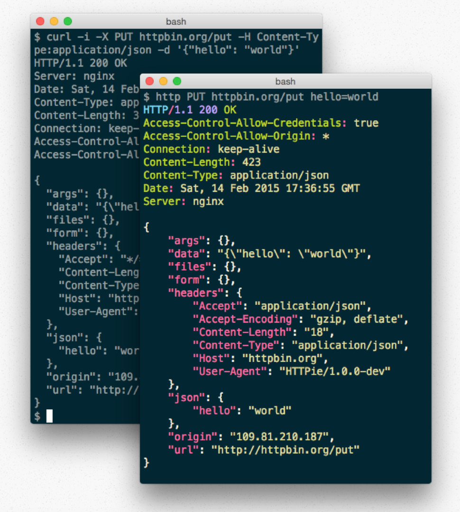

# 超爽的HTTP命令行客户端HTTPie

## httpie
之前在命令行下进行HTTP服务的调试和信息查看都是使用经典的cURL，不过前段时间发现一个交互更加友好的工具，就是HTTPie, [主页下载](https://github.com/jkbrzt/httpie#from=codefrom.com)。

先放一个HTTPie官方的一个HTTPie VS cURL的图给大家看看。
<center></center>

如果你经常需要用终端以非交互模式访问网络服务器（比如，下载文件、测试REST服务），可能你会选择的工具是wget或curl，通过大量的选项，这两种工具也都可以处理很多非交互网络访问的情况（比如，如何通过wget下载多个文件，如何在wget中设置自定义的http头，如何在curl中设置自定义的HTTP头）。然而，除非你很精通这些繁复的语法细节，这些工具对于你来说，不过是简单的下载工具而已。

> “Its goal is to make CLI interaction with web services as human-friendly as possible. It provides a simple http command that allows for sending arbitrary HTTP requests using a simple and natural syntax, and displays colorized output. ”

HTTPie则在使用时的表现力、人性化做得比wget、curl好得多，就像在官网上宣传的那样，它追求的是人性化、简单自然的语法，以及彩色的输出。而且HTTPie还有一些不错的优点，比如对JSON的良好支撑、持久性会话等特性。

上面说了那么多，咱们废话少说，先来了解并展示一下HTTPie。

** 安装 **

- Debian, Ubuntu或Linux Mint

```bash
sudo apt-get install httpie
```

- Fedora，CentOS/RHEL

```bash
sudo yum install httpie
```

- 或者使用python的方式来安装

```bash
sudo  pip install --upgrade httpie
```

- Mac OSX

```bash
brew install httpie
```

** 使用例子 ** 

- 定制头部

```bash
http www.grdtechs.com/2016/05/24/comparison-of-Go-Vendoring-Tools/ User-Agent:Xmodlo/1.0 Referer:http://www.grdtechs.com
```

这个HTTP请求看起是这样。

```bash 
HTTP/1.1 200 OK
Access-Control-Allow-Origin: *
Cache-Control: max-age=600
Content-Encoding: gzip
Content-Type: text/html; charset=utf-8
Date: Wed, 25 May 2016 08:25:18 GMT
Expires: Wed, 25 May 2016 08:35:18 GMT
Last-Modified: Tue, 24 May 2016 10:31:21 GMT
Server: GitHub.com
Transfer-Encoding: chunked
X-GitHub-Request-Id: 3AF604B6:7A86:215F0A34:5745616E
```

- 下载文件
你也可以把HTTPie作为文件下载器来使用。

```bash
http www.grdtechs.com/2016/05/24/comparison-of-Go-Vendoring-Tools/ >comparison-of-Go-Vendoring.html
```
或者

```bash
http --download www.grdtechs.com/2016/05/24/comparison-of-Go-Vendoring-Tools/
```

- 使用其他HTTP方法

除了默认的GET方法，你还可以使用其他方法（比如PUT、POST、DELETE、HEAD）
** PUT **
```bash
http PUT researchlab.github.io name='Mike Json' email='mikejson@email.com'
```

** POST **

```bash
http -f POST researchlab.github.io name='Mike Json' email='mikejson@email.com'
```

-f 选项使http命令序列化数据字段，并将Content-Type设置为`application/x-www-form-urlencoded;charset=utf-8`

这个HTTP POST请求看起这样：

```bash
POST / HTTP/1.1
Accept: */*
Accept-Encoding: gzip, deflate
Connection: keep-alive
Content-Length: 41
Content-Type: application/x-www-form-urlencoded; charset=utf-8
Host: mikejson.github.io
User-Agent: HTTPie/0.9.2

name=Mike+Json&email=mikejson%40email.com
```

** HEAD ** 

```bash
http HEAD researchlab.github.io
```

HEAD这个方法只会让服务器返回http response headers。

这个命令结果如下：

- Request

```bash
HEAD / HTTP/1.1
Accept: */*
Accept-Encoding: gzip, deflate
Connection: keep-alive
Host: researchlab.github.io
User-Agent: HTTPie/0.9.2
```

- Response

```bash
HTTP/1.1 200 OK
Accept-Ranges: bytes
Access-Control-Allow-Origin: *
Age: 0
Cache-Control: max-age=600
Connection: keep-alive
Content-Encoding: gzip
Content-Length: 36794
Content-Type: text/html; charset=utf-8
Date: Wed, 15 Jul 2015 09:26:22 GMT
Expires: Wed, 15 Jul 2015 09:36:22 GMT
Last-Modified: Sun, 12 Jul 2015 11:32:15 GMT
Server: GitHub.com
Vary: Accept-Encoding
Via: 1.1 varnish
X-Cache: MISS
X-Cache-Hits: 0
X-Served-By: cache-fra1227-FRA
X-Timer: S1436952382.011631,VS0,VE99
```

** JSON支持 **
HTTPie内置JSON的支持。事实上HTTPie默认使用的`Content-Type`就是`application/json`。因此，当你不指定`Content-Type`发送请求参数时，它们就会自动序列化为JSON对象。

```bash
http POST researchlab.github.io name='Mike Json' email='mikejson@email.com'
```

这个请求看起来就是这样：

```bash
POST / HTTP/1.1
Accept: application/json
Accept-Encoding: gzip, deflate
Connection: keep-alive
Content-Length: 52
Content-Type: application/json
Host: researchlab.github.io
User-Agent: HTTPie/0.9.2

{
    "email": "mikejson@email.com",
    "name": "Mike Json"
}
```

- 输入重定向

HTTPie的另外一个友好特性就是输入重定向，你可以使用缓冲数据提供HTTP请求内容。例如：

```bash
http POST researchlab.github.io < my_info.json
```

或:

```bash
echo '{"name": "Mike Json","email": "mikejson@email.com"}' | http POST researchlab.github.io
```

好了，暂时演示这么多吧，估计大家对HTTPie也有了一个基本的了解。如果大家想看看更多的HTTPie的特性和功能，可以看看HTTPie的README，并且自己安装一个尝试使用一下。估计到时候你也和我一样对其爱不释手，立马抛弃了wget和curl。