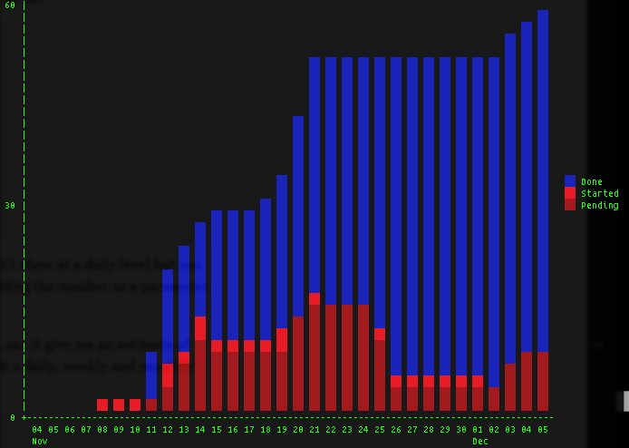

# Task Warrior 

Task Warrior is a command line GTD/task manager tool. And it's so cool!

本文翻译自[Getting Things Done with Task Warrior](http://chariotsolutions.com/blog/post/getting-things-done-with-task-warrior/)

## 安 装
```bash
$ brew install task # for OS X
$ sudo apt-get install task  # for Debian Linux 
```

## 添加任务
```bash
$ task add "Write blog post on how awesome task warrior is" project:blog +taskwarrior
```
此时`Task warrior`会提示需要创建一个配置文件.
```bash
A  configuration file could not be found in

Would you like a sample /Users/<username>/.taskrc created, so taskwarrior can proceed? (yes/no)
```
输入`yes` 默认即可， 此时提示 Created task 1.
```bash
Created task 1.
The project 'blog' has changed.  Project 'blog' is 0% complete (1 of 1 tasks remaining).
```

**注:** `+taskwarrior` 表示为`blog` Project 添加`tag`.

下面为`blog`任务添加子任务
```bash
$ task add "install task warrior on os x" project:blog +taskwarrior
Created task 2.
The project 'blog' has changed.  Project 'blog' is 0% complete (2 of 2 tasks remaining).
```
task 2 作为子任务添加到`blog`下面，同样为其添加了`taskwarrior`tag. 下面再来多添加一些子任务
```bash 
$ task add "install task warrior on linux" project:blog +taskwarrior
$ task add "find and install markdown editor/viewer" project:blog +taskwarrior
```

## 修改任务 
现在总共有4个任务，其中一些可能是真到子任务或阻塞任务，先来看一下任务列表
```bash 
$ task ls
ID Proj Age Description
 1 blog 9m  Write blog post on how awesome task warrior is
 2 blog 3m  install task wrrior on os x
 3 blog 25s install task warrior on linux
 4 blog 5s  find and install markdown editor/viewer

4 tasks
```
假如task1 需要在task2,3,4之后才能开始进行，则
```
$ task 1 modify depends:2-4
Modifying task 1 'Write blog post on how awesome task warrior is'.
Modified 1 task.
Project 'blog' is 0% complete (4 of 4 tasks remaining).
```

上面到`depends`做了什么？ 实际是把task1 作为阻塞任务，只有等task2,3,4完成之后才能开始进行task1, 具体看task warrior 
```bash 
$ task 1 info

Name                 Value
ID                   1
Description          Write blog post on how awesome task warrior is
Status               Pending
Project              blog
This task blocked by 2 install task warrior on os x
                     3 install task warrior on linux
                     4 find and install markdown editor/viewer
Tags                 taskwarrior
UUID                 fd0c5165-c189-4616-a680-cc9599df0a8d
Entered              11/22/2013 22:32:13 (15 mins)
Urgency              -3.2
Last modified        11/22/2013 22:47:44 (4 secs)

Date                Modification
11/22/2013 22:47:44 Dependencies set to '2, 3, 4'.
                    Modified set to '11/22/2013 22:47:44'.
```

## 设置任务优先级
task warriro 把任务分成`L`,`M`,`H`(低，中，高)三个等级。
```bash
$ task 4 modify priority:L
$ task 2,3 modify priority:M
```

## 设置任务截至日期
```bash
$ task 1 modify due:2d
```
设置task 1 在两天内需要完成，意味着task2,3,4需要在这个截至日期之前就需要完成，因为task 1 在上面被设置为task2,3,4的后置任务。

```bash
$ task next

ID Proj Pri Due        Age Urg  Description
 2 blog M              29m 13.7 install task warrior on os x
 3 blog M              26m 13.7 install task warrior on linux
 4 blog L              26m 11.6 find and install markdown editor/viewer
 1 blog     11/24/2013 35m 4.96 Write blog post on how awesome task warrior is
```
`task next` 会按照任务的紧急程度从紧急度高到低的顺序排序出所有待做到任务，如上面所示现在应该开始做task 2。所以我需要先开始执行"install task warrior on os x"。

```bash 
$ task 2 start
```
完成任务
```bash
$ task 2 done
$ task 3 done
```
完成之后会提示当前所有任务到进度
```bash
The project 'blog' has changed.  Project 'blog' is 50% complete (2 of 4 tasks remaining).
```
辣么，下一项任务是 ？
```bash 
$ task next

ID Proj Pri Due        Age Urg  Description
 2 blog L              23h 11.6 find and install markdown editor/viewer
 1 blog     11/24/2013 23h 4.96 Write blog post on how awesome task warrior is
```
有了`vim`之后其实也可以不需要`markdown editor`
```bash 
$ task 2 delete
```

## 报 表

### 按时间序列生成报表 
```bash
$ task timesheet

11/17/2013 - 11/23/2013
  Completed (2 tasks)
    Project Due Description
    blog        install task warrior on os x
    blog        install task warrior on linux

  Started (0 tasks)
```

### 生成图表
task warrior 可以按daily, weekly, monthly（天，星期，月）生成图表
```bash
$ task burndown.daily

Add rate:         4/d      Estimated completion: No convergence
Done/Delete rate: 2/d
```
**注:** ` task burndown` 效果同 `task burndown.daily` 一样。
<center></center>

task warrior 支持许多reporting commands, 同时也支持自定义reporting commands
```bash
task ghistory
task history
task long
task calendar
```
## 过滤器
可以在命令后面加上任务范围即可达到过滤到目的。
```bash
task ghistory project:blog
task burndown.daily +taskwarrior
```

## 最 后
```bash
$ task 1 done

Completed task 1 'Write blog post on how awesome task warrior is'.
Completed 1 task.
The project 'blog' has changed.  Project 'blog' is 100% complete (0 of 3 tasks remaining).
```


